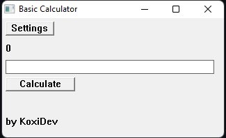

# test-application (Basic Calculator)
Made by **KoxiDev**. This is a very simple Win32 and C++ practice project.
I decided to learn GitHub too, so I published my project here. This is one of my first projects ever published on GitHub.

Unfortunately, for those who like contributing to random projects, I do not accept pull requests. I want to work on the project myself!

---

0.2.0

I doubt this app will be ever that useful to install and use, since there are already many free calculators out there. But if someone does, then hey, I am not complaining!

The app itself is very basic and at the moment doesn't have any exciting features.
However, as my knowledge about the Win32 API increases, I will be adding more features to the app.
